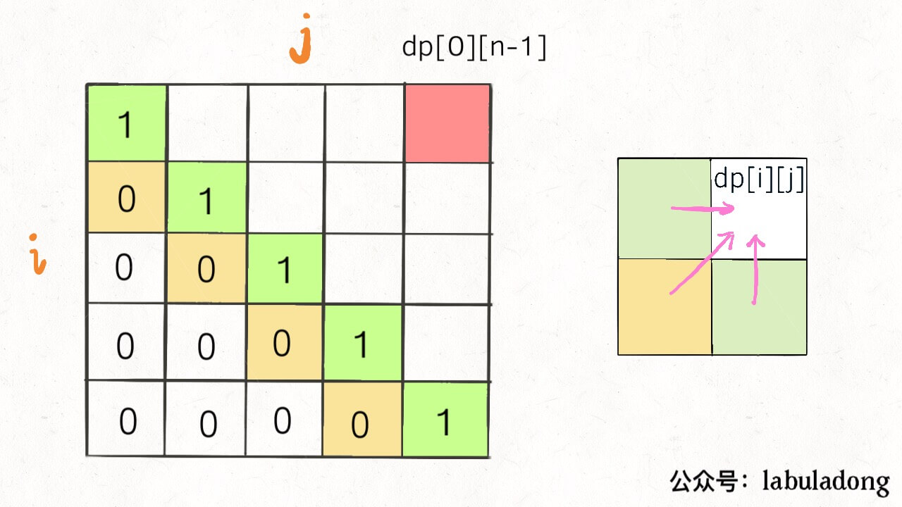

# Leetcode problem on DP

## [53. Maximum Subarray](https://leetcode-cn.com/problems/maximum-subarray/)
- Define the DP, in this problem, the 1-D dp[i] means the max sum subarray ends in index i

```python
class Solution:
    def maxSubArray(self, nums: List[int]) -> int:
        if not nums:
            return 0 
        
        if len(nums) == 1:
            return nums[0]
        
        length = len(nums)
        
        dp = [0]*(length)
        dp[0] = nums[0]
        
        
        for i in range(1, length):
            dp[i] = max(dp[i-1] + nums[i], nums[i])
            
        
        
        return max(dp)

```

## [152 Maximum Product Subarray](https://leetcode.com/problems/maximum-product-subarray/)
- What's the different between this with max subarray sum? (deal with max number)
- so in addition to dp array, what additional variables needed for this (store the min, max prod so far)
- [solution explain](https://leetcode-cn.com/problems/maximum-product-subarray/solution/dpfang-fa-xiang-jie-by-yang-cong-12/)

```python
class Solution:
    def maxProduct(self, nums: List[int]) -> int:
        if not nums:
            return 0
        
        if len(nums) == 1:
            return nums[0]
        
        length = len(nums)
        
        dp = [0]*length
        
        dp[0] = nums[0]
        max_dp, min_dp = nums[0], nums[0]
        
      
        for i in range(1, length):
            temp_max = max_dp
            max_dp = max(max_dp*nums[i], min_dp*nums[i], nums[i])
            min_dp = min( temp_max*nums[i], min_dp*nums[i], nums[i])
            dp[i] = max_dp
            
        # print(dp)
        
        return max(dp)

```

## [1143. Longest Common Subsequence](https://leetcode.com/problems/longest-common-subsequence/)
- From which direction to think about the dp? (backward should be easier)
- think the base cases
- think about the reward of deletion operation is zero
- [solution explain](https://leetcode-cn.com/problems/longest-common-subsequence/solution/dong-tai-gui-hua-zhi-zui-chang-gong-gong-zi-xu-lie/)


```python
class Solution:
    def longestCommonSubsequence(self, text1: str, text2: str) -> int:
        if not text1 or not text2:
            return 0
        
        
        len_txt1, len_txt2 = len(text1), len(text2)
        
        dp = [[0]*(len_txt2+1) for _ in range(len_txt1+1)]
        
        for i in range(1, len_txt1+1):
            for j in range(1, len_txt2+1):
                if text1[i-1] == text2[j-1]:
                    dp[i][j] = max(dp[i-1][j-1]+1, dp[i-1][j], dp[i][j-1])
                else:
                    dp[i][j] = max(dp[i-1][j], dp[i][j-1])
                    
        
        return dp[len_txt1][len_txt2]
```

[516. Longest Palindromic Subsequence](https://leetcode.com/problems/longest-palindromic-subsequence/)
- think about the meaning of dp[i,j]
- transit function in ways of dp[i+1, j-1], dp[i, j-1], dp[i+1, j], with their rewards 
- base case of dp[i,i], what does it means?
- The computation direction in terms of i and j 



__direction code__

```python
# one way of direction
for diag in (1, N):
    for i in range(N-diag):
        j = i + diag

# another way of direction (in C++) by Labuladong
    for (int i = n - 1; i >= 0; i--) {
        for (int j = i + 1; j < n; j++) {
            // 状态转移方程
            if (s[i] == s[j])
                dp[i][j] = dp[i + 1][j - 1] + 2;
            else
                dp[i][j] = max(dp[i + 1][j], dp[i][j - 1]);
        }
    }

```
__code__
```python

class Solution:
    def longestPalindromeSubseq(self, s: str) -> int:
        if not s:
            return 0
        
        height = len(s)
        dp = [[0]*height for _ in range(height)]
        
        for i in range(height):
            dp[i][i] = 1 
        
        for diag in range(1, height):
            for i in range(height - diag):
                j = diag + i
                
                if s[i] == s[j]:
                    dp[i][j] = max(dp[i+1][j-1]+2, dp[i+1][j], dp[i][j-1])
                else:
                    dp[i][j] = max(dp[i+1][j], dp[i][j-1])
        
        return dp[0][height-1]
```

## [300. Longest Increasing Subsequence]

### Method1: dynamic programming
- dp[i], the LIS ended with i start from 0
- base case: initialize that dp[i] = 1 for all i start from 0 to the end because the min LIS for all dp[i] is 1, which is itself
- transition function dp[i] = max( dp[j]+1 for j < i and nums[j] < nums[i])
- O(N^2)

```python
class Solution:
    def lengthOfLIS(self, nums: List[int]) -> int:
        if not nums:
            return 0
        
        # dp[i], the LIS from index 1 to i including i
        # base case dp[i] = max(dp[j])+1, j<i
        n = len(nums)
        
        dp = [1]*(n+1)
        
        for i in range(1,n+1):
            for j in range(1,i):
                if nums[i-1] > nums[j-1]:
                    dp[i] = max(dp[i],dp[j]+1)
        
        return max(dp)
        

```


### Method2 patient sort
- put the card on the leftmost pile where the this car val higher or equal to the current top card on the pile
- if not found slot in current piles, create the new pile with binary search 
- O(NlogN)

```python
class Solution:
    def lengthOfLIS(self, nums: List[int]) -> int:
        piles = [sys.maxsize]*len(nums)
        
        rightmost_pos = 0
        for num in nums:
            insert_pos = self.find_pile(piles, num, rightmost_pos)
            print(insert_pos, rightmost_pos)
            if insert_pos == rightmost_pos:
                rightmost_pos += 1 
                
            piles[insert_pos] = num 
            # print(piles)
            
        return rightmost_pos
    
    
    def find_pile(self, piles, num, rightmost_pos):
        """
        find the leftmost pile that could insert the num in 
        
        """
        left, right = 0, rightmost_pos
        
        while left+1 < right:
            mid = (right - left) // 2 + left 
            if piles[mid] > num:
                right = mid
            else:
                left = mid
        
        
        if piles[left] >= num:
            return left
        else:
            return right
        

```

## [416. Partition Equal Subset Sum](https://leetcode.com/problems/partition-equal-subset-sum/)
- Even though it's 1d array, using 2d 0-1 backpack to solve
- First check if the sum of the nums could be mod by 2, if not return false
- Then check if it possible to get the half sum of the nums from those nums
- the dp[i][j] is a boolean value to indicate if select nums from 1 to i and sum the selected ones, is it possible to get val j 
- dp[i][j] = dp[i-1][j-nums[i]] or dp[i-1][j]
- Finally, check dp[len of nums][half sum of nums]

```python

"""
first check if sum(nums) %2 == 0, yes continue, no return false
dp the size of the sum(nums)//2, 
dp[i] dp[i-num] and dp[num]

dp[i]  

the 

dp[i][j], to select num from 1 to i in numbers, if it call just fill the j val sum 
base case: dp[0][0] = True, dp[0][j] = False, dp[i][0]=True

transit state: dp[i][j] = dp[i-1][j-nums[i]] or dp[i-1][j]

"""
class Solution:
    def canPartition(self, nums: List[int]) -> bool:
        if sum(nums) %2 != 0:
            return False 
        
        half_sum = sum(nums) // 2
        len_nums = len(nums)
        
        dp = [[False]*(half_sum + 1) for _ in range(len_nums+1)]
        
        # base case
        for i in range(len_nums+1):
            dp[i][0] = True
        
        for i in range(1, len_nums+1):
            for j in range(1, half_sum+1):
                if j >= nums[i-1]:
                    dp[i][j] = dp[i-1][j-nums[i-1]] or dp[i-1][j]
                else:
                    dp[i][j] = dp[i-1][j]
                
        return dp[len_nums][half_sum]
            
        
```

## [62. Unique Paths](https://leetcode.com/problems/unique-paths/)
- use `functools.lru_cache` as the memo hashmap
- Similar problem [63. Unique Paths II](https://leetcode.com/problems/unique-paths-ii/)
    - take care if obstacles at start or end
    - this case `lru_cache` cannot used, since there is list in the function call which is not hashable


```python
from functools import lru_cache

class Solution:
    def uniquePaths(self, m: int, n: int) -> int:
        
        
        return self.dfs(0,0,m,n)
     
    @lru_cache(maxsize=None)
    
    def dfs(self, x,y, m,n):
        if x == m-1 and y == n-1:
            return 1
        
        dirs = [(0,1), (1,0)]
        
        sum_move = 0
        
        for dx, dy in dirs:
            next_x, next_y = x +dx, y+dy
            
            
            if self.is_valid(next_x, next_y, m,n):
                sum_move += self.dfs(next_x, next_y, m,n)
                
                
        return sum_move 
    
    
    def is_valid(self, next_x, next_y, m,n):
        if next_x >=m or next_y >= n:
            return False
        
        return True 

```
